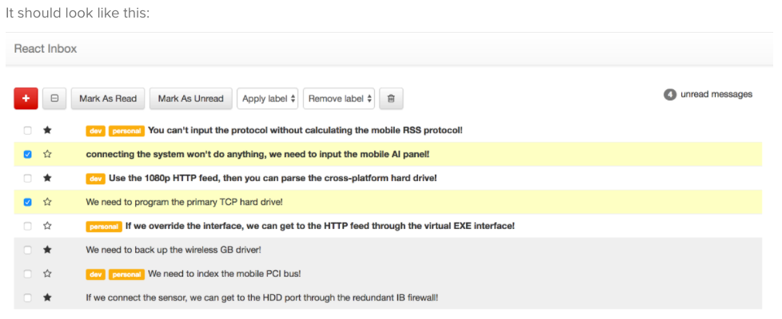
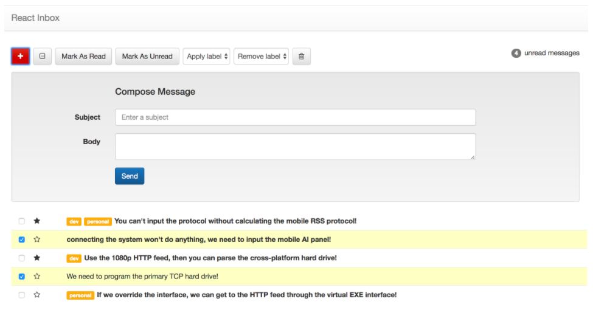

# angular-inbox
## Building an inbox with Angular 1.6

[Angular 1.X Inbox Deployed Site](https://week3project-ee31f.firebaseapp.com/)

[Angular 1.X Inbox Server](https://young-bastion-40394.herokuapp.com/api)

[A styleguide for the Inbox frontend project](https://github.com/gSchool/inbox-styleguide)

### Setup HTML & CSS

**In index.html add the following:**

*(to link Font Awesome)*

```[js]
<link> href="https://maxcdn.bootstrapcdn.com/font-awesome/4.7.0/css/font-awesome.min.css" rel="stylesheet" </link>
```

*(to link Bootstrap Theme)*

```[js]
 <link> rel="stylesheet" href="https://maxcdn.bootstrapcdn.com/bootstrap/3.3.7/css/bootstrap-theme.min.css" integrity="sha384-rHyoN1iRsVXV4nD0JutlnGaslCJuC7uwjduW9SVrLvRYooPp2bWYgmgJQIXwl/Sp" crossorigin="anonymous" </link>
 ```

*(to link Bootstrap)*

```[js]
<link> rel="stylesheet" href="https://maxcdn.bootstrapcdn.com/bootstrap/3.3.7/css/bootstrap.min.css" integrity="sha384-BVYiiSIFeK1dGmJRAkycuHAHRg32OmUcww7on3RYdg4Va+PmSTsz/K68vbdEjh4u" crossorigin="anonymous" </link>
```

*(to link Angular 1.6)*

```[js]
<script> src="https://ajax.googleapis.com/ajax/libs/angularjs/1.6.4/angular.min.js" </script>
```

*Make sure to link other files you are working in*

**From the styleguide, copy the CSS from the CSS tab into the /css.style.css file**

(touch a style.css file into a css folder if you haven't already)

### Component Hierarchy

* Normally you get to how to organize components when you create an app. For this app, make sure have at least:

- [x] An App component

- [x] A Messages (or MessageList) component

- [x] A Message component

- [x] A Toolbar component

This will be important for the next unit on testing, where you'll test each of those 4 components using a different strategy.

### Stories


**Message Display**

* - [x] Users should see a list of messages with the correct styles

When a user views the app:
 - [x] Then they should see a list of messages with their subjects
 - [x] If the message is read, it should have the read style
 - [x] If the message is unread, it should have the unread
 - [x] If the message is selected, it should have the selected style and the box should be checked
 - [x] If there are labels on a message, they should appear
 - [x] If the message is starred, then the star should be filled in, otherwise it should be empty

**Starring**

*  - [x] Users should be able to star and unstar a message.

When a user clicks the star next to a message:
 - [x] Then it should toggle whether the message is starred or not
 *For example if it was starred, and you clicked on it, it should be unstarred*

**Selecting Individual Messages**

*  - [x] Users should be able to select and deselect individual messages.

When a user checks the checkbox on a message
 - [x] Then the message should be highlighted

When a user unchecks the checkbox on a message
 - [x] Then the message should not_be highlighted

**Bulk Select / Deselect**

*  - [x] Users should be able to select and deselect messages.

Given that no messages are selected:
 - [x] When a user checks the "Select All" checkbox
 - [x] Then it should check all messages (and highlight them)

Given that some messages are selected:
 - [x] When a user checks the "Select All" checkbox
 - [x] Then it should check all messages (and highlight them)

Given that all messages are selected:
 - [x] When a user unchecks the "Select All" checkbox
 - [x] Then it should uncheck all messages (and unhighlight them)

**Select All Button State**

 * - [x] Users should see the state of the select all button change as messages are selected

When no messages are checked:
  - [x] Then the "Select All" button should be in the "unchecked" state

When some messages are checked:
  - [x] Then the "Select All" button should be in the "half-checked" state

When all messages are checked:
  - [x] Then the "Select All" button should be in the "checked" state

 *NOTE: the "Select All" button must stay in sync at all times.*

**Marking Messages as Read**

*  - [x] Users should be able to mark messages as read.

When a user selects messages and presses "Mark As Read":
 - [x] Then each selected message should be marked as read (and should no longer be bold)

**Marking Messges as Unread**

*  - [x] Users should be able to mark messages as unread.

When a user selects messages and presses "Mark As Unread":
 - [x] Then each selected message should be marked as unread (and should should appear bold)

**Deleting Messages**

*  - [x] Users should be able to delete selected messages

When a user selects a message and presses "Delete" (the Trash icon):
 - [x] Then each selected message should be removed from the list
 - [x] And the unread count should update
 - [x] And "Select All" button should update

**Adding Labels**

When a user selects messages from the sidebar and chooses a label from the "Add Label" dropdown:
 - [x] That label should be added to all selected messages
*NOTE: if the message already contains the label then it should not be added twice && It's OK to hard-code the list of labels*

**Removing Labels**

When a user selects messages from the sidebar and chooses a label from the "Remove Label" dropdown:
 - [x] That label should be removed from all of the selected messages that contain the label

*NOTE: It's OK to hard-code the list of labels && If you try to remove a label from a message that doesn't have that label, there should be no errors*

**Unread Message Count**

*  - [x] Users should always see the number of unread messages

When a user changes which messages are read / unread:
 - [x] The unread count in the upper right-hand corner should update
 - [x] When there are 0 unread messages it should display "0 unread messages"
 - [x] When there is 1 unread message it should display "1 unread message"
 - [x] When there's more than 1 unread message it should display "_n_ unread messages"

**Select All Button State**

 - [ ] Users should not be able to click on toolbar items when no messages are selected

## API Integration

[Set up the API server setup locally](https://github.com/RoxMBaldwin/hypermedia-api-server)

### General Stories:

**Post all of the actions:**

 - [x] star / unstar
 - [x] mark read / unread
 - [x] add / remove labels
 - [x] delete

**Add a 'compose' view:**

 - [ ] form appears when the |+| button is clicked
 - [ ] new entry is added to sidebar

### Specific Stories:

**Load the messages from the Server**

When a user goes to your inbox app:
 - [x] the messages they see should be the ones loaded from the Server

**Actions should update the server-side**

When a user stars or unstars a message and then reloads the page:
 - [x] the data is persisted: the message stays starred / unstarred

When a user marks messsages read or unread and refreshes the page:
 - [x] the data is persisted: the message stays marked as read / unread

When a user deletes messages and refreshes the page:
 - [x] the data is persisted: the messages stay deleted

When a user adds or removes labels and refreshes the page:
 - [x] the data is persisted: the labels stay removed or added

**Add the ability to compose messages**

When a user goes to the app:
 - [ ] they should see a red plus button

When the user clicks the |+| button:
 - [ ] the compose form appears

When the user fills out the subject and body and pressed Send:
 - [ ] the compose forms disappears
 - [ ] the message appears on the page

When the user refreshes the page:
 - [ ] the data is persisted: the new message still appears in the sidebar






When the user opens the compose form and presses the red compose button:
 - [ ] the compose form should close
