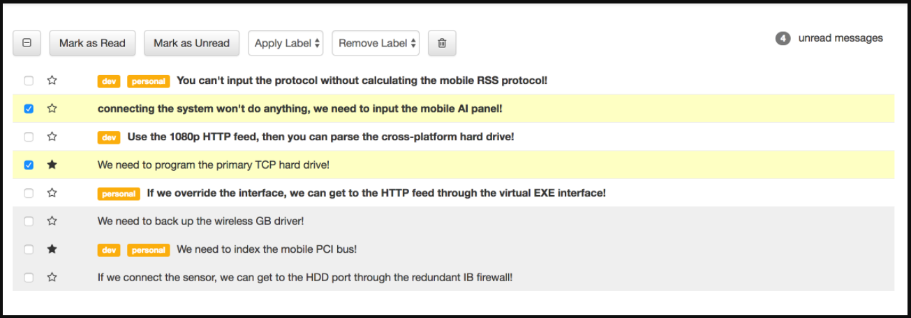

# angular-inbox
## Building an inbox with Angular 1.6

* [A styleguide for the Inbox frontend project](https://github.com/gSchool/inbox-styleguide)

### Setup CSS

**In index.html add the following:**

*(to link Font Awesome)*

<link href="https://maxcdn.bootstrapcdn.com/font-awesome/4.7.0/css/font-awesome.min.css" rel="stylesheet>"

*(to link Bootstrap)*

<link href=“//netdna.bootstrapcdn.com/bootstrap/3.3.7/css/bootstrap.min.css” rel=“stylesheet”>

*(to link Angular 1.6)*

*Make sure to link other files you are working in**

**From the styleguide, copy the CSS from the CSS tab into the /css.style.css file**

(touch a style.css file into a css folder if you haven't already)

### Component Hierarchy

Normally you get to how to organize components when you create an app. For this app, make sure have at least:

* An App component

* A Messages (or MessageList) component

* A Message component

* A Toolbar component

This will be important for the next unit on testing, where you'll test each of those 4 components using a different strategy.

### Stories

**Message Display**

* Users should see a list of messages with the correct styles

When a user views the app
Then they should see a list of messages with their subjects
If the message is read, it should have the read style
If the message is unread, it should have the unread
If the message is selected, it should have the selected style and the box should be checked
If there are labels on a message, they should appear
If the message is starred, then the star should be filled in, otherwise it should be empty

**Starring**

* Users should be able to star and unstar a message.

When a user clicks the star next to a message
Then it should toggle whether the message is starred or not
For example if it was starred, and you clicked on it, it should be unstarred

**Selecting Individual Messages**

* Users should be able to select and deselect individual messages.

When a user checks the checkbox on a message
Then the message should be highlighted

When a user unchecks the checkbox on a message
Then the message should not_be highlighted

**Bulk Select / Deselect**

* Users should be able to select and deselect messages.

Given that no messages are selected
When a user checks the "Select All" checkbox
Then it should check all messages (and highlight them)

Given that some messages are selected
When a user checks the "Select All" checkbox
Then it should check all messages (and highlight them)

Given that all messages are selected
When a user unchecks the "Select All" checkbox
Then it should uncheck all messages (and unhighlight them)

**Marking Messages as Read**

* Users should be able to mark messages as read.

When a user selects messages
And presses "Mark As Read"
Then each selected message should be marked as read
And should no longer be bold

**Marking Messges as Unread**

* Users should be able to mark messages as unread.

When a user selects messages
And presses "Mark As Unread"
Then each selected message should be marked as unread
And should should appear bold

**Deleting Messages**

* Users should be able to delete selected messages

When a user selects messages
And presses "Delete" (the Trash icon)
Then each selected message should be removed from the list
And the unread count should update
And "Select All" button should update

**Adding Labels**

When a user selects messages from the sidebar
And chooses a label from the "Add Label" dropdown
Then that label should be added to all selected messages
But if the message already contains the label then it should not be added twice

*NOTE: It's OK to hard-code the list of labels*

**Removing Labels**

When a user selects messages from the sidebar
And chooses a label from the "Remove Label" dropdown
Then that label should be removed from all of the selected messages that contain the label

*NOTE: It's OK to hard-code the list of labels

NOTE: If you try to remove a label from a message that doesn't have that label, there should be no errors*

**Unread Message Count**

* Users should always see the number of unread messages

When a user changes which messages are read / unread
Then the unread count in the upper right-hand corner should update
And when there are 0 unread messages it should display "0 unread messages"
And when there is 1 unread message it should display "1 unread message"
And when there's more than 1 unread message it should display "_n_ unread messages"

**Select All Button State**

* Users should see the state of the select all button change as messages are selected

When no messages are checked
Then the "Select All" button should be in the "unchecked" state

When some messages are checked
Then the "Select All" button should be in the "half-checked" state

When all messages are checked
Then the "Select All" button should be in the "checked" state

*NOTE: the "Select All" button must stay in sync at all times.*

**Select All Button State**

Users should not be able to click on toolbar items when no messages are selected
